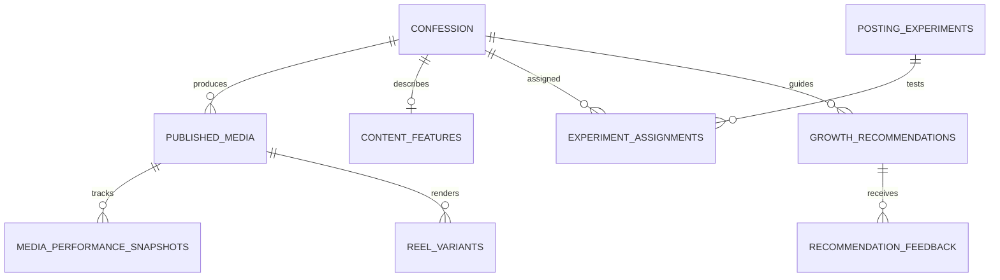

# ConfessionFlow - Architecture Report & Growth Intelligence Blueprint

## 1. Executive Summary & Non-Breaking Principles
ConfessionFlow is an automated Instagram publishing and campus confession management platform. This report provides a comprehensive architectural baseline of the existing system and establishes non-breaking integration boundaries for the new **Growth Intelligence Platform**.

### Core Guarantees:
1. **Zero Destabilization**: Existing modules for Google Sheets ingestion, Groq AI moderation, Sharp image generation, Instagram publishing, and calendar scheduling remain functionally identical.
2. **Feature-Flagged by Default**: All Growth Intelligence features default to `false`:
   - `ENABLE_GROWTH_INTELLIGENCE=false`
   - `ENABLE_ANALYTICS_COLLECTION=false`
   - `ENABLE_REEL_ENGINE=false`
   - `ENABLE_GROWTH_RECOMMENDATIONS=false`
   - `ENABLE_AUTO_OPTIMIZATION=false`
   - `ENABLE_EXPERIMENTS=false`
3. **Decoupled Publishing Safety**: Publishing never awaits or depends on analytics collection. If analytics collection fails, post publication remains 100% successful.
4. **Epistemological Integrity**: The system never claims correlation equals causation (e.g. reporting "8 PM had higher median reach in observed sample" rather than "8 PM causes higher reach"). Confounders, sample sizes, and confidence intervals are explicitly reported.

---

## 2. Existing System Architecture Audit

### 2.1 Ingestion & Processing
- **Google Sheets / Forms**: `services/googleSheetsService.ts` polls Google Sheets API v4 using service account credentials. Ingests raw rows into internal `Confession` objects.
- **AI Moderation & PII Shield**: `services/moderationService.ts` and `services/aiService.ts`. Uses dual-tier regex + Groq Llama-3.3-70B model to redact phone numbers/handles and assign risk levels (`LOW`, `MEDIUM`, `HIGH`).
- **Review Queue**: `app/review/page.tsx` and `services/confessionService.ts`. Supports manual approval, editing, template switching, rejection, and 1-click failed queue restart.

### 2.2 Content Generation & Graphics
- **Sharp Image Service**: `services/imageService.ts` renders 1080×1350 4:5 portrait PNG cards using 6 built-in themes (Classic Monochrome, Dark Velvet, Minimalist Editorial, Love & Romance, Campus & College, Funny & Relatable) with dynamic font scaling (14px–50px).
- **Public Card Hosting**: `app/generated/[filename]/route.ts` serves compiled cards to Meta's container creation endpoint.

### 2.3 Instagram Publishing & Scheduling
- **Meta Graph API v21.0**: `services/instagramService.ts` creates media containers, polls container status until `FINISHED`, publishes via `/media_publish`, and extracts permalinks.
- **Humanized Scheduler**: `services/schedulingService.ts` enforces 9 AM–10 PM daytime windows, overnight sleep, dynamic organic random gaps (45m–95m), and anti-bot jitter.
- **24/7 Background Runner**: `services/backgroundRunner.ts` runs automated Google Sheets polling, auto-publish evaluation, and anti-sleep keep-alive pings.

### 2.4 Data Layer & Dual Persistence
- **Dual-Mode Persistence**: `lib/mockStore.ts` provides file-backed persistence in `.mock_data.json` for local/mock environments, while `lib/supabase/` and `supabase/migrations/` provide PostgreSQL storage for Supabase environments.

---

## 3. Growth Intelligence Data Model Architecture

The new Growth Intelligence subsystem introduces 10 complementary, additive entities:

1. **`published_media`**: Tracks every published Instagram media object (IMAGE, REEL, CAROUSEL, VIDEO, OTHER).
2. **`media_performance_snapshots`**: Periodic time-series snapshots at 15m, 30m, 60m, 3h, 6h, 12h, 24h, 48h, 72h, 7d. Distinguishes `NULL` (unavailable) from `0` (explicit zero).
3. **`metric_definitions`**: Metadata layer documenting metric support across API versions.
4. **`content_features`**: NLP extracted features (word count, reading time, hook type, emotional tone, themes).
5. **`posting_experiments`**: Controlled experiment definition with explicit hypothesis, factor, and dates.
6. **`experiment_assignments`**: Balanced assignment of content to experiment variants with confounder tracking.
7. **`growth_recommendations`**: What, Why, How Much (sample size), Confidence, and Limitations.
8. **`recommendation_feedback`**: Logs admin reaction (Accepted, Rejected, Overridden).
9. **`reel_variants`**: Tracks generated video reels (aspect ratio, duration, animation style, audio licensing).
10. **`daily_growth_aggregates`**: Pre-aggregated summary metrics for rapid dashboard loading.

---

## 4. Integration Boundaries & Non-Breaking Invariants
- **No Direct Coupling in `publishPost`**: The publishing function succeeds or fails independently of whether performance tracking is initialized.
- **Asynchronous Event Emitted on Publish**: After a post is marked `PUBLISHED`, a non-blocking background hook records `published_media` and registers observation milestones.
- **Backward-Compatible UI**: The existing `/dashboard`, `/confessions`, `/review`, `/calendar`, and `/published` routes remain unmodified in layout and function. A new `/growth` route is added to the navigation.
- **Mock Store & Supabase Mirroring**: Growth store logic is fully compatible with both `.mock_data.json` and Supabase SQL migrations.
