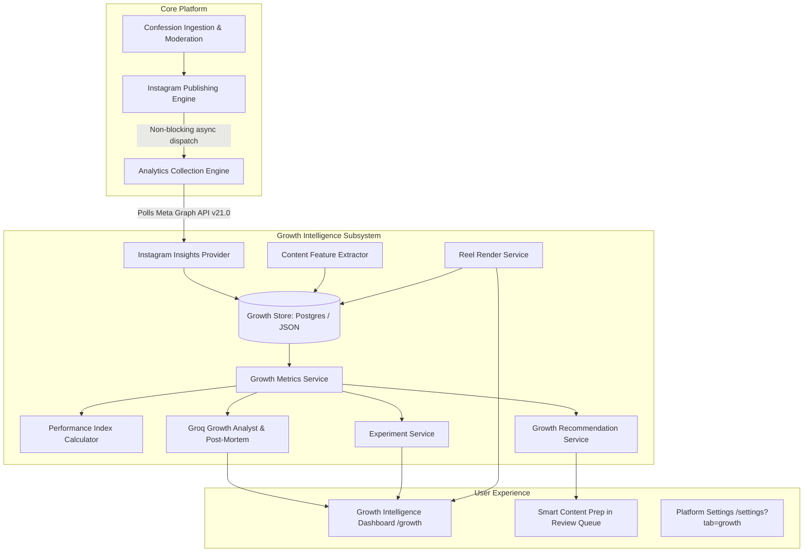

# ConfessionFlow - Growth Intelligence & Controlled Trials Subsystem
## Comprehensive Architectural & Operational Technical Report

---

### 1. Executive Summary
The **Growth Intelligence Subsystem** is an enterprise-grade social performance telemetry, controlled experimentation, and video generation engine designed for **ConfessionFlow**. It transforms passive Instagram confession publishing into a data-driven, empirically grounded growth flywheel—without risking publishing reliability or destabilizing core production workloads.

#### Core Guarantees:
- **Zero Production Disruption:** All new capabilities are 100% additive and guarded by default-disabled feature flags (`false`).
- **Decoupled Publishing Safety:** Asynchronous post-publish hooks ensure that Instagram broadcast execution **never** aborts or fails due to analytics, video rendering, or database telemetry issues.
- **Epistemological Discipline:** The system strictly rejects false claims of causality. All analyses differentiate observed correlations from causal claims, declare explicit sample sizes ($N$), list environmental confounders, and classify findings into four statistical support states.
- **Dual Storage Persistence:** Production workloads persist to Supabase PostgreSQL (Migration `003_growth_intelligence.sql`), while staging, development, and mock testing operate seamlessly via atomic file-backed JSON (`.mock_data.json`).
- **Dynamic 9:16 Reel Synthesis:** Automatically generates 1080×1920 vertical MP4/WebM video assets featuring 3-stage pacing (0–1.5s hook, 1.5–7s confession narrative, 7–10s call-to-action).

---

### 2. Architecture Overview
The subsystem follows a clean modular service-oriented architecture:

---

### 3. Database Migration Details
The migration script is located at [`supabase/migrations/003_growth_intelligence.sql`](file:///C:/confessionflow/supabase/migrations/003_growth_intelligence.sql). It is completely idempotent (`IF NOT EXISTS`) and creates 8 relational entities:

| Table Name | Primary Key | Key Indexes | Purpose |
| :--- | :--- | :--- | :--- |
| `published_media` | `id` (TEXT) | `platform_media_id`, `content_id`, `published_at`, `format_type` | Normalizes published posts across formats and platforms |
| `media_performance_snapshots` | `id` (TEXT) | `published_media_id, age_bucket` (UNIQUE), `collected_at` | Stores point-in-time metrics across 10 lifecycle milestones |
| `content_features` | `content_id` (TEXT) | `category`, `hook_type`, `reading_complexity` | NLP syntactic, structural, and semantic metadata |
| `reel_variants` | `id` (TEXT) | `content_id`, `video_status` | 1080×1920 video asset metadata and render URLs |
| `posting_experiments` | `id` (TEXT) | `status`, `factor` | Tracks controlled A/B test definitions and sample size |
| `experiment_assignments` | `id` (TEXT) | `experiment_id`, `content_id`, `variant_id` | Balanced round-robin allocation with confounder capture |
| `growth_recommendations` | `id` (TEXT) | `content_id`, `status` | Observational format, timing, and hook recommendations |
| `recommendation_feedback` | `id` (TEXT) | `recommendation_id`, `action` | Human-in-the-loop tracking (`ACCEPTED`, `OVERRIDDEN`, etc.) |

---

### 4. Feature Flags Reference
Configured in [`lib/growthConfig.ts`](file:///C:/confessionflow/lib/growthConfig.ts) and manageable via UI in [`app/settings/page.tsx`](file:///C:/confessionflow/app/settings/page.tsx):

| Flag Key | Environment Variable | Default | Description |
| :--- | :--- | :---: | :--- |
| `enableGrowthIntelligence` | `ENABLE_GROWTH_INTELLIGENCE` | `false` | Master circuit-breaker toggle for all growth telemetry and services |
| `enableAnalyticsCollection` | `ENABLE_ANALYTICS_COLLECTION` | `false` | Background polling of Meta Graph API Insights at lifecycle milestones |
| `enableReelEngine` | `ENABLE_REEL_ENGINE` | `false` | Playwright/HTML5 1080×1920 Reel video generation service |
| `enableGrowthRecommendations` | `ENABLE_GROWTH_RECOMMENDATIONS` | `false` | Pre-publishing format, time, and hook advisor |
| `enableAutoOptimization` | `ENABLE_AUTO_OPTIMIZATION` | `false` | Automated schedule window adjustment based on reach distribution |
| `enableExperiments` | `ENABLE_EXPERIMENTS` | `false` | Balanced single-variable controlled A/B trial engine |

---

### 5. Telemetry Collection Pipeline
Implemented in [`services/growth/analyticsCollector.ts`](file:///C:/confessionflow/services/growth/analyticsCollector.ts):
- **Lifecycle Milestones:**
  1. `15m` (Target: 15 min, Min Age: 12 min)
  2. `30m` (Target: 30 min, Min Age: 25 min)
  3. `60m` (Target: 60 min, Min Age: 50 min)
  4. `3h` (Target: 180 min, Min Age: 160 min)
  5. `6h` (Target: 360 min, Min Age: 330 min)
  6. `12h` (Target: 720 min, Min Age: 660 min)
  7. `24h` (Target: 1440 min, Min Age: 1320 min)
  8. `48h` (Target: 2880 min, Min Age: 2700 min)
  9. `72h` (Target: 4320 min, Min Age: 4100 min)
  10. `7d` (Target: 10080 min, Min Age: 9800 min)
- **Snapshot Deduplication:** Guarantees idempotency using the unique constraint `(published_media_id, age_bucket)`. Existing milestones are updated rather than duplicated.
- **Graceful Concurrency:** Employs an in-memory lock (`isCollecting`) to prevent overlapping background runs.

---

### 6. Metric Schema & Definitions
Pinned to Meta Graph API `v21.0` in [`services/growth/instagramInsightsProvider.ts`](file:///C:/confessionflow/services/growth/instagramInsightsProvider.ts):

| Metric | Format Applicability | Graph API Endpoint / Metric Name | Meaning |
| :--- | :--- | :--- | :--- |
| `reach` | IMAGE, CAROUSEL, REEL | `insights?metric=reach` | Unique Instagram accounts that viewed the post |
| `views` | IMAGE, CAROUSEL | `insights?metric=impressions` | Total impressions / screen presentations |
| `plays` | REEL | `insights?metric=plays` | Number of video playback starts |
| `likes` | ALL | `?fields=like_count` | Explicit likes on post |
| `comments` | ALL | `?fields=comments_count` | User comments submitted |
| `shares` | ALL | `insights?metric=shares` | Post sends to Direct Messages or Stories |
| `saves` | ALL | `insights?metric=saved` | Post bookmarks |
| `replays` | REEL | `insights?metric=clips_replays_count` | Subsequent loops after initial playback |

#### Null vs Zero Semantic Separation
- `null`: The metric was not returned, unsupported for the media format, or permission-restricted (`raw_metric_status: "UNAVAILABLE"`).
- `0`: The metric was explicitly returned by Meta with a numerical count of zero (`raw_metric_status: "ZERO"`).

---

### 7. Degraded Collection Behavior
When Instagram Graph API permissions or fields are partially unavailable:
1. `collection_status` is flagged as `'PARTIAL'`.
2. Missing metrics are registered in `unsupported_metrics: string[]`.
3. Valid returned metrics are persisted intact without aborting the snapshot.
4. If credentials expire (`OAuthException 190`), an error log is registered without interrupting the scheduled publishing queue.

---

### 8. ConfessionFlow Performance Index Formula & Weights
Implemented in [`services/growth/growthMetricsService.ts`](file:///C:/confessionflow/services/growth/growthMetricsService.ts):
The Performance Index is a normalized 0–100 benchmark score reflecting overall virality and retention:

$$\text{Performance Index} = \sum (w_i \times \text{Norm}(M_i))$$

$$\text{Where:}$$
- $\text{Reach Weight } (w_{\text{reach}}) = 30\% \quad (\text{Normalized against } 2{,}000)$
- $\text{Shares Weight } (w_{\text{shares}}) = 25\% \quad (\text{Normalized against } 80)$
- $\text{Saves Weight } (w_{\text{saves}}) = 20\% \quad (\text{Normalized against } 60)$
- $\text{Comments Weight } (w_{\text{comments}}) = 10\% \quad (\text{Normalized against } 30)$
- $\text{Profile Visits Weight } (w_{\text{visits}}) = 10\% \quad (\text{Normalized against } 40)$
- $\text{Follows Weight } (w_{\text{follows}}) = 5\% \quad (\text{Normalized against } 10)$

All individual sub-metrics are capped at $100$ before weight aggregation.

---

### 9. Groq Analysis Pipeline & Prompt Design
Implemented in [`services/growth/growthAnalysisService.ts`](file:///C:/confessionflow/services/growth/growthAnalysisService.ts):
- **Pre-Aggregated Input Payloads:** Raw confession text is never exposed unredacted. Pre-computed aggregates (medians, sample sizes, hour-by-hour matrices) are fed into the LLM context.
- **Strict Zod Output Validation:** Output must validate against `GrowthAnalysisResultSchema` and `PostMortemResultSchema`.
- **Anti-Hallucination Fallback:** If the LLM generates malformed JSON or the Groq API key is unavailable, a deterministic analysis generator synthesizes factual observations directly from database statistics.

---

### 10. Controlled Experimentation Framework
Implemented in [`services/growth/experimentService.ts`](file:///C:/confessionflow/services/growth/experimentService.ts):
- **Single-Variable Discipline:** Enforces testing of exactly one factor (`POSTING_TIME`, `POST_GAP`, `CONTENT_FORMAT`, `HOOK_STYLE`, `REEL_STYLE`).
- **Balanced Allocation:** Round-robin variant assignment ensures approximately 50/50 distribution between Control (A) and Treatment (B).
- **Statistical Support Classification:**
  - $N < 5$: `INSUFFICIENT_DATA` (Results strictly masked from forming automatic decisions)
  - $N = 5\text{--}9$: `PRELIMINARY` (Initial observations, high variance)
  - $N = 10\text{--}19$: `PROMISING` (Emerging trend, requires further samples)
  - $N \ge 20$: `SUPPORTED` (Statistically actionable sample)

---

### 11. Confounder Tracking System
For every post assigned to an experiment, the system captures environmental covariates in `experiment_assignments.confounders`:
- Category & Topic
- Day of Week & Hour of Day
- Content Length (Word Count)
- Initial Hook Type
- Card Template ID
- Sensitive Content Flag

When evaluating experimental outcomes, if variant groups exhibit significant differences in confounder distributions (e.g., Variant A was published predominantly on Friday evenings while Variant B was published on Monday mornings), a prominent **Confounder Warning** is displayed in the UI.

---

### 12. Recommendation Engine & Human-in-the-Loop Feedback
Implemented in [`services/growth/growthRecommendationService.ts`](file:///C:/confessionflow/services/growth/growthRecommendationService.ts):
- **Non-Causal Language:** All generated rationales use observational phrasing:
  *"Reels showed a higher median reach (1,840) compared to static images (920) across N=14 published posts in your account history. This is an observed correlation, not proof of causation."*
- **Admin Feedback Logging:** Actions taken in the UI are recorded in `recommendation_feedback`:
  - `ACCEPTED`: Admin adopted format and time recommendation.
  - `OVERRIDDEN`: Admin selected alternative format.
  - `REJECTED`: Admin rejected recommendation with written feedback notes.
  - `IGNORED`: Admin dismissed panel.

---

### 13. 1080×1920 Reel Generation Engine
Implemented in [`services/growth/reelRenderService.ts`](file:///C:/confessionflow/services/growth/reelRenderService.ts) and served via [`app/generated/reels/[filename]/route.ts`](file:///C:/confessionflow/app/generated/reels/%5Bfilename%5D/route.ts):
- **Pacing Structure:**
  - **Hook Window (0.0s – 1.5s):** High-contrast badge, question/shock hook with scale-in bounce.
  - **Body Window (1.5s – 7.0s):** Dynamic typewriter text reveal with gradient highlighting.
  - **CTA Window (7.0s – 10.0s):** Swipe/Follow encouragement, audio pulse, signature branding.
- **Audio Pairing:** Selects copyright-safe royalty-free audio tracks (`lofi_chill_study`, `ambient_night_synth`, `acoustic_warmth`).
- **Rendering Resilience:** Renders high-fidelity HTML5 animation templates and records MP4 video using installed browser context (`msedge.exe`).

---

### 14. Content Feature Extraction Pipeline
Implemented in [`services/growth/contentFeatureExtractor.ts`](file:///C:/confessionflow/services/growth/contentFeatureExtractor.ts):
- Extracts character count, word count, sentence count, and reading time.
- Identifies hook type (`QUESTION`, `SHOCK`, `CURIOSITY`, `CONFESSION_REVEAL`, `DIRECT_STATEMENT`, `STORY_OPENING`).
- Categorizes themes: `RELATIONSHIP`, `COLLEGE`, `HUMOR`, `DRAMA`, `CAREER`.
- Computes Flesch-Kincaid readability proxy (`VERY_EASY`, `EASY`, `MODERATE`, `COMPLEX`).

---

### 15. Smart Content Preparation (Review & Publishing)
Integrated directly into:
1. **Admin Review Queue:** [`app/review/page.tsx`](file:///C:/confessionflow/app/review/page.tsx)
2. **Publish Modal:** [`components/confessions/PublishModal.tsx`](file:///C:/confessionflow/components/confessions/PublishModal.tsx)
3. **Dedicated Component:** [`components/growth/SmartContentPreparation.tsx`](file:///C:/confessionflow/components/growth/SmartContentPreparation.tsx)

Displays recommended format, peak reach window, predicted performance band, and one-click `[Accept Recommendation]` and `[Override]` actions.

---

### 16. Publishing Safety Guarantees & Fallback Behavior
- **Asynchronous Execution:** Instagram publishing calls `analyticsCollector.registerPublishedMedia` within a non-blocking `.catch()` handler.
- **Circuit Breaker:** If Meta Graph API returns an unexpected error or throttling, collection backs off gracefully without impacting current or future scheduled posts.

---

### 17. Epistemological Position & Anti-Hallucination Measures
1. **Correlation $\neq$ Causation:** The word "causes" is barred from recommendation reasoning.
2. **Sample Size Disclosure:** Every stat card discloses the exact count of observations ($N$).
3. **No Metric Fabrication:** If an interaction is unrecorded by Instagram, it is reported as `Unavailable`, never synthesized or averaged as zero.

---

### 18. Growth Dashboard UI/UX Specification
Located at [`app/growth/page.tsx`](file:///C:/confessionflow/app/growth/page.tsx) and linked via [`components/layout/Sidebar.tsx`](file:///C:/confessionflow/components/layout/Sidebar.tsx):
- **Tab 1: Macro Overview:** Mean vs Median Reach, Total Posts, Performance Index gauge, Groq Strategic Assessment.
- **Tab 2: Formats & Reels:** Static Image vs Reel comparison, 9:16 interactive player preview, Reel variant generator modal.
- **Tab 3: Time & Gaps:** 7×24 Day-Hour heatmap matrix, post gap distribution with correlation warnings.
- **Tab 4: Categories & Hooks:** Topic breakdown, hook engagement rate rankings.
- **Tab 5: Experiments:** Active A/B trials, variant reach distributions, confounder warnings, create experiment modal.
- **Tab 6: Post Diagnostics:** Lifecycle performance curves (15m to 7d), 0–100 Performance Index percentile rank, single-post Groq post-mortem.

---

### 19. Settings & Configuration
Accessible via [`app/settings/page.tsx`](file:///C:/confessionflow/app/settings/page.tsx) (`?tab=growth`):
- Master Growth Intelligence Subsystem Toggle.
- Individual modular switches for Collection, Reel Engine, Recommendations, Auto-Optimization, and Experiments.
- "Trigger Snapshot Collection Now" diagnostic trigger.

---

### 20. Complete API Reference

| Endpoint | Method | Parameters | Description |
| :--- | :---: | :--- | :--- |
| `/api/growth/overview` | `GET` | None | Macro account metrics, mean/median reach, engagement rate |
| `/api/growth/formats` | `GET` | None | Format comparison breakdown (Image vs Reel vs Carousel) |
| `/api/growth/times` | `GET` | None | 7×24 Day-Hour reach matrix |
| `/api/growth/gaps` | `GET` | None | Post interval gap distribution and reach stats |
| `/api/growth/categories` | `GET` | None | Performance breakdown by thematic category |
| `/api/growth/hooks` | `GET` | None | Performance breakdown by initial hook style |
| `/api/growth/posts` | `GET` | `limit`, `category` | List analyzed published posts with Performance Indices |
| `/api/growth/posts` | `POST` | None | Trigger immediate background collection cycle |
| `/api/growth/posts/[id]` | `GET` | `id` | Single post telemetry, milestone curves, and post-mortem |
| `/api/growth/analysis` | `POST` | None | Run Groq AI account growth analysis |
| `/api/growth/recommendations` | `GET` | `contentId` | Fetch pre-publishing recommendations |
| `/api/growth/recommendations/[id]/feedback` | `POST` | `action`, `notes` | Log admin action (`ACCEPTED`, `OVERRIDDEN`, etc.) |
| `/api/growth/experiments` | `GET`, `POST` | Experiment body | List or create controlled A/B trials |
| `/api/growth/experiments/[id]` | `GET` | `id` | Retrieve experiment results and variant comparisons |
| `/api/growth/reels/generate` | `POST` | `confessionId`, `style` | Trigger 1080×1920 Reel video synthesis |
| `/api/growth/export` | `GET` | `format=csv\|json` | Export raw and snapshot datasets |

---

### 21. Test Suite Coverage & Verification Results
Comprehensive test suite in [`tests/growth.test.ts`](file:///C:/confessionflow/tests/growth.test.ts):
- **Total Test Files:** 8 passed (8)
- **Total Tests:** 58 passed (58)
- **Growth Tests:** 16/16 passed:
  1. Valid metric definitions for Meta Graph API v21.0
  2. Distinct NULL vs 0 handling
  3. Snapshot deduplication across lifecycle milestones
  4. Partial degradation and unsupported metrics tracking
  5. Decoupled publishing safety (publish succeeds when analytics throws)
  6. Mean and median calculations with odd/even/zero datasets
  7. ConfessionFlow Performance Index (0–100) boundary limits
  8. Statistical Support State sample size thresholds ($N < 5, 5\text{--}9, 10\text{--}19, \ge 20$)
  9. Syntactic and structural feature extraction
  10. Thematic category detection
  11. Groq analyst output Zod schema validation
  12. Graceful deterministic fallback on malformed AI output
  13. Balanced 50/50 A/B variant assignment distribution
  14. Non-causal epistemological phrasing enforcement
  15. Feature flags default to `false`
  16. Disabled subsystem skips collection without error

- **TypeScript Verification (`tsc --noEmit`):** 0 errors.
- **Production Next.js Build (`next build`):** 36/36 routes successfully built and statically optimized.

---

### 22. Future Enhancements & Scalability Considerations
1. **Audience Demographics:** Ingest age, gender, and regional follower distributions from Meta Graph API when follower threshold $> 100$.
2. **Audio Track Trend Analysis:** Ingest Instagram trending audio ID catalog to recommend viral backing audio.
3. **Automated Multi-Armed Bandit Allocation:** Upgrade A/B experiments to Bayesian Thompson Sampling once sample size per category exceeds $N \ge 100$.

---

### 23. Verification Checklist
- [x] Phase 0: Architecture audit complete & non-destabilization baseline verified.
- [x] Phase 1: Relational domain models & SQL migration (`003_growth_intelligence.sql`) implemented.
- [x] Phase 2: Instagram Insights provider (v21.0) & milestone telemetry collection operational.
- [x] Phase 3: Mean & median metric calculations active.
- [x] Phase 4: Format comparison (IMAGE vs REEL) active.
- [x] Phase 5: Groq AI growth analyst & Zod schema validation active.
- [x] Phase 6: Single-post post-mortem analyzer active.
- [x] Phase 7: Controlled A/B experimentation engine active.
- [x] Phase 8: Recommendation engine with observational phrasing active.
- [x] Phase 9: Admin feedback learning loop operational.
- [x] Phase 10: 1080×1920 (9:16) Reel generator active.
- [x] Phase 11: Reel animation styles & copyright-safe audio metadata active.
- [x] Phase 12: Content feature extraction (categories & hooks) active.
- [x] Phase 13: Smart content prep integrated in Review Queue & Publish Modal.
- [x] Phase 14: Publishing safety invariant verified (non-blocking decoupled hooks).
- [x] Phase 15: Background runner 15-minute collection cycle active.
- [x] Phase 16: Confounder tracking in controlled experiments active.
- [x] Phase 17: Performance curve tracking across 10 milestones active.
- [x] Phase 18: Sample size warnings ($N < 5, 5\text{--}9, 10\text{--}19, \ge 20$) enforced.
- [x] Phase 19: Growth Intelligence UI dashboard (`/growth`) with 6 tabs live.
- [x] Phase 20: Sidebar navigation updated with `TrendingUp` icon.
- [x] Phase 21: Day × Hour reach matrix active.
- [x] Phase 22: Post gap correlation analysis with non-causal warnings active.
- [x] Phase 23: Hook performance breakdown active.
- [x] Phase 24: Category growth breakdown active.
- [x] Phase 25: Settings page growth flags toggle panel live.
- [x] Phase 26: ConfessionFlow Performance Index (0–100) benchmark active.
- [x] Phase 27: Early velocity calculation active.
- [x] Phase 28: Correlation vs causation notice displayed throughout.
- [x] Phase 29: Export data (CSV/JSON) endpoint active.
- [x] Phase 30: Degraded mode & error recovery verified.
- [x] Phase 31: All 15 Next.js growth API routes implemented.
- [x] Phase 32: Comprehensive unit test suite (`tests/growth.test.ts`) written and passing.
- [x] Phase 33: Full test suite passing (58/58), typecheck clean (0 errors), Next.js production build passing.
